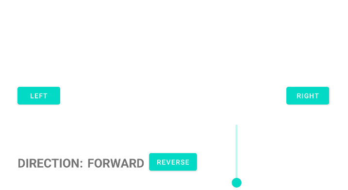

# Robot Control System: Android App (Java) 🤖📱

A professional Android application designed to control a custom-built mobile robot via a RESTful API. This project is part of a full-stack IoT solution, encompassing both mobile software and embedded firmware.

---

## 📸 Application layout

There are three buttons: "left", "right", and "reverse" to change the direction of travel. The slider allows you to set the speed. The direction of travel is also visible.

---

## 📺 Video Demonstration
Check out the robot in action and see the app's interface:
👉 **[Watch the Demo on YouTube](https://www.youtube.com/watch?v=m3dwk-Td9KI)**

---

## 🚀 Overview
This repository contains the **Android (Java)** part of the system. The application allows for real-time movement control, speed adjustment, and receives status feedback from the robot.

### 🔗 Companion Project
The robot's software (Java) can be found here:
👉 **[Java-Software](https://github.com/MarcinRejniak/Wifi-Robot-App)**

---

## 🛠️ Technical Stack (Android)
- **Language:** Java 8 (utilizing Lambda expressions)
- **Networking:** [OkHttp 4.10.0](https://square.github.io/okhttp/) (Asynchronous communication)
- **Architecture:** Optimized `OkHttpClient` instance for resource management.
- **UI/UX:** ConstraintLayout with Material Design 3 (Slider, TouchListeners for real-time control).
- **Data Format:** JSON (standardized communication with the microcontroller).

---

## 🧠 Key Features
This project underwent a significant **Refactoring Phase** to meet professional software standards:
1. **Throttling Mechanism:** Implemented logic to limit the frequency of speed-change requests, preventing microcontroller flooding.
2. **Touch-Driven Control:** Used `OnTouchListener` instead of simple clicks to provide a realistic "gamepad" experience.
3. **Robust Error Handling:** Comprehensive JSON parsing and network failure feedback displayed directly in the UI.

---

## 🏗️ System Architecture
The system follows a Client-Server model where the Android app acts as the client sending JSON payloads via HTTP POST requests to an Arduino-based web server.

